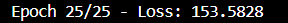
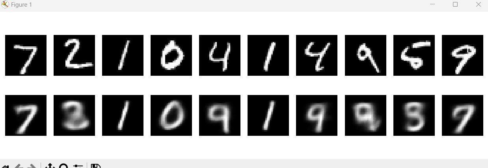
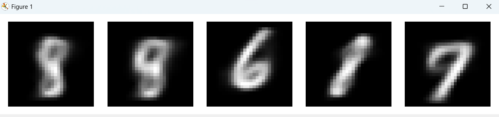

# lab1-genai-cv

## Partie 1 : Implémentation du Variational Autoencoder (VAE)

### Réponses aux Questions
**1. Pourquoi utilise-t-on le reparameterization trick dans les VAE ?**

Le reparameterization trick (z=μ+σ⋅ϵ) permet de rendre le processus d’échantillonnage différentiable vis-à-vis des paramètres du réseau (mean et log_var). Sans ce trick, l’échantillonnage aléatoire empêcherait le calcul du gradient à travers la couche stochastique. En séparant la partie aléatoire (ϵ∼N(0,1)) de la partie déterministe (calcul de μ et σ), on permet la rétropropagation standard.

**2. Comment la perte de divergence KL (KL Divergence) affecte-t-elle l’espace latent ?**

La divergence KL agit comme un terme de régularisation. Elle pousse la distribution encodée (définie par μ et σ) à se rapprocher d’une distribution gaussienne standard N(0,I). En pratique, cela évite que l’encodeur n’exploite « trop » de liberté dans l’espace latent ; il tend à « recentrer » et « resserrer » les échantillons autour de 0, imposant une structure plus régulière et plus lisse dans l’espace latent.

**3. Comment la modification de la dimension de l’espace latent (latent_dim) impacte-t-elle la qualité de la reconstruction ?**

En général, plus latent_dim est grand, plus le modèle dispose de capacités pour encoder l’information, ce qui peut améliorer la qualité de reconstruction (au risque d’overfitter).
Moins latent_dim est grand, plus la représentation est contrainte et donc moins précise, ce qui peut se traduire par des reconstructions de moins bonne qualité mais un espace latent plus « compact » et potentiellement plus régulier pour la génération.
Il existe donc un compromis à trouver en fonction de la tâche (qualité de reconstruction, génération, etc.).

## Partie 1 : De VAE à GAN

### Réponses aux Questions
**1. Comment le décodeur d’un VAE peut-il servir de générateur pour un GAN ?**

Dans un GAN (Generative Adversarial Network), le générateur prend un échantillon z (généralement issu d’une distribution normale N(0,I)) et produit une image (ou un signal) réaliste.
Le décodeur d’un VAE fait exactement cela : étant donné un vecteur latent **z**, il génère une image. Ainsi, on peut réutiliser la même architecture (et même les poids si l’on souhaite) du décodeur pour servir de générateur dans un GAN.

**2. Différences entre l’encodeur VAE et le discriminateur GAN**

Un encodeur de VAE prend une image et la projette dans un espace latent (retourne μ et logσ^2). Il ne produit pas une probabilité « vrai/faux », mais des paramètres de distribution latente.
Un discriminateur de GAN prend une image (réelle ou générée) et retourne une probabilité qu’elle soit réelle (vs. fake). Il s’agit d’un classifieur binaire, tandis que l’encodeur sert plutôt d’« encodeur probabiliste ».

## Résultats VAE

### Test 1 

### Test 2 

## Résultats GAN
Après le test 2 vae : 
